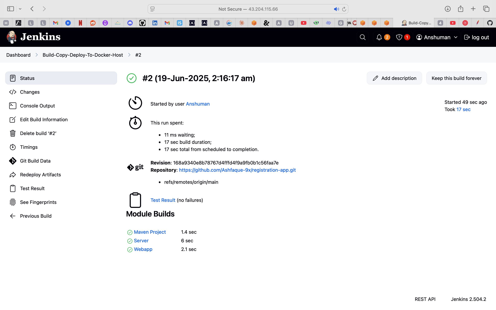

# Jenkins CI/CD Pipeline with Docker Integration

This project demonstrates the implementation of a complete CI/CD pipeline using Jenkins and Docker on AWS infrastructure. The setup automates the build, test, and deployment process for applications using containerization.

## 🏗️ Architecture Overview

The project consists of two main EC2 instances:
- **Jenkins Server**: Handles CI/CD pipeline orchestration
- **Docker Host**: Manages containerized application deployments

## 🚀 Project Implementation Steps

### 1. Jenkins Server Setup
- Launched an EC2 instance named `JENKINS-SERVER` using Amazon Linux Quick Start
- Installed and configured Jenkins on AWS Linux
- Set up Jenkins with necessary security configurations

### 2. Maven Integration
- Installed Maven build tool on the Jenkins server
- Configured Maven environment variables for global accessibility
- Installed Maven plugin in Jenkins
- Integrated Maven with Jenkins for automated builds


### 3. Docker Host Configuration
- Set up a dedicated Docker-Host EC2 instance
- Enabled password authentication for secure access
- Configured Docker runtime environment

### 4. Jenkins-Docker Integration
- Integrated Docker-Host with Jenkins server
- Established secure communication between instances
- Configured Jenkins to deploy artifacts to Docker server



### 5. Automated Deployment Pipeline
- Created Jenkins job for building and deploying artifacts
- Implemented Dockerfile at DockerHost for automated deployment
- Set up containerized deployment workflow


### 6. Complete Automation
- Automated build and deployment process on Docker containers
- Implemented continuous integration and deployment pipeline
- Achieved seamless application delivery


## 🛠️ Technologies Used

- **AWS EC2**: Cloud infrastructure hosting
- **Jenkins**: CI/CD pipeline automation
- **Maven**: Build automation and dependency management
- **Docker**: Containerization platform
- **Amazon Linux**: Operating system

## 📋 Prerequisites

- AWS Account with EC2 access
- Basic knowledge of Linux commands
- Understanding of CI/CD concepts
- Familiarity with Docker and containerization

## 🔧 Key Features

- **Automated Builds**: Maven-based build automation
- **Containerized Deployment**: Docker-based application deployment
- **Scalable Infrastructure**: AWS EC2-based scalable setup
- **Continuous Integration**: Automated testing and integration
- **Continuous Deployment**: Seamless deployment to production

## 📈 Benefits Achieved

- **Reduced Deployment Time**: Automated pipeline reduces manual intervention
- **Improved Reliability**: Consistent deployment process
- **Scalability**: Easy to scale with additional Docker containers
- **Version Control**: Better tracking of application versions
- **Environment Consistency**: Docker ensures consistent environments

## 🚦 Pipeline Workflow

1. **Code Commit** → Triggers Jenkins build
2. **Maven Build** → Compiles and packages application
3. **Artifact Creation** → Generates deployable artifacts
4. **Docker Deployment** → Deploys to containerized environment
5. **Automated Testing** → Validates deployment success

## 📁 Jenkins Job Configuration Details

- **Source Code Management**: Git repository integration
- **Build Step**: Maven goal `clean package`
- **Post-Build Actions**:
  - Transfer .war file to Docker-Host
  - SSH commands for automated deployment:
    ```bash
    docker build -t webapp:v1 .
    docker stop registerapp
    docker rm registerapp
    docker run -d --name registerapp -p 8086:8080 webapp:v1
    ```

## 🌐 Deployment Access

The application is deployed and served by Tomcat on the Docker host.
Access URL: `http://<your-ec2-public-ip>:8086/<app-name>`

## 📚 Skills Demonstrated

- Jenkins setup and configuration
- Maven build integration
- CI/CD pipeline automation
- Docker image building and container orchestration
- Artifact deployment via SSH
- Managing multiple EC2 instances with defined roles

## 📝 Future Enhancements

- Integration with version control systems (Git)
- Implementation of automated testing stages
- Addition of monitoring and logging solutions
- Multi-environment deployment (Dev, Staging, Production)
- Integration with AWS services like ECR and ECS

## 🤝 Contributing

Feel free to contribute to this project by:
- Reporting issues
- Suggesting improvements
- Adding new features
- Enhancing documentation

## 📄 License

This project is open source and available under the [MIT License](LICENSE).

---

**Note**: This project demonstrates a complete DevOps pipeline implementation using industry-standard tools and practices. It serves as a foundation for building robust CI/CD solutions in cloud environments.

**Updated by**: Anshuman-git-code
